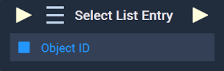
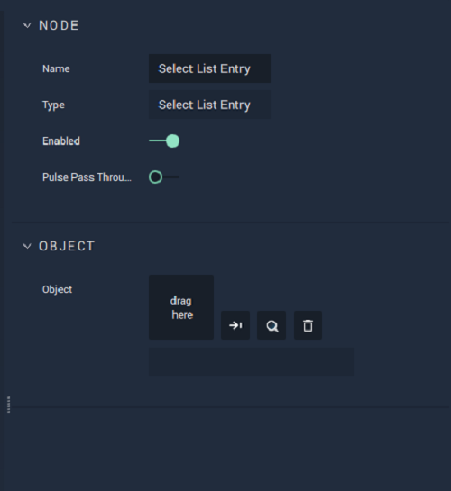

# Select List Entry

## Overview

**Select List Entry** selects an entry item in a **List** **Object**.

[**Scope**](../../overview.md#scopes): **Scene**, **Function**, **Prefab**.

## Attributes

### Object

| Attribute | Type | Description |
| :--- | :--- | :--- |
| `Object` | **ObjectID** | The target **List** **Object** you want to select an entry of, if one is not provided in the `Object ID` **Socket**. |

## Inputs

| Input | Type | Description |
| :--- | :--- | :--- |
| _Pulse Input_ \(►\) | **Pulse** | A standard **Input Pulse**, to trigger the execution of the **Node**. |
| `Object ID` | **ObjectID** | The **List** **Object** you want to select an entry of. |

## Outputs

| Output | Type | Description |
| :--- | :--- | :--- |
| _Pulse Output_ \(►\) | **Pulse** | A standard **Output Pulse**, to move onto the next **Node** along the **Logic Branch**, once this **Node** has finished its execution. |

## Usage Example

## See Also

* [**List**](../../../objects-and-types/scene-objects/list-widget.md)
* [**Generate List**](generate-list.md)
* [**Next List Entry**](next-list-entry.md)

