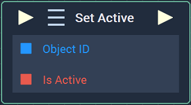
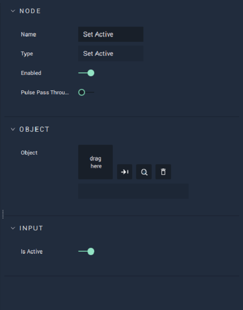

# Set Active

## Overview

**Set Active** activates or deactivates a **List** **Object** in a **Scene**. It accepts a **List** **Object** and a **Boolean** value `Is Active`. If `Is Active` is _true_, then the **List** **Object** is activated otherwise, it is deactivated.

[**Scope**](../../overview.md#scopes): **Scene**, **Function**, **Prefab**.

## Attributes

### Object

| Attribute | Type | Description |
| :--- | :--- | :--- |
| `Object` | **ObjectID** | The target **List** **Object** you wish to activate or deactivate, if one is not provided in the `Object ID` **Socket**. |

### Input

| Attribute | Type | Description |
| :--- | :--- | :--- |
| `Is Active` | **Bool** | A default **Boolean** switch, which activates and deactivates the **List** **Object**, if no value is provided to the `Is Active` input **Socket**. |

## Inputs

| Input | Type | Description |
| :--- | :--- | :--- |
| _Pulse Input_ \(►\) | **Pulse** | A standard **Input Pulse**, to trigger the execution of the **Node**. |
| `Object ID` | **ObjectID** | The target **List** **Object** you wish to activate or deactivate. |
| `Is Active` | **Bool** | If `Is Active` is _true_, the **List** **Object** is activated, otherwise is deactivated. |

## Outputs

| Output | Type | Description |
| :--- | :--- | :--- |
| _Pulse Output_ \(►\) | **Pulse** | A standard **Output Pulse**, to move onto the next **Node** along the **Logic Branch**, once this **Node** has finished its execution. |

## See Also

* [**List**](../../../objects-and-types/scene-objects/list-widget.md)
* [**Generate List**](generate-list.md)
* [**Previous List Entry**](previous-list-entry.md)

