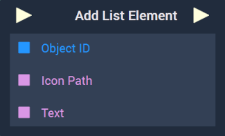
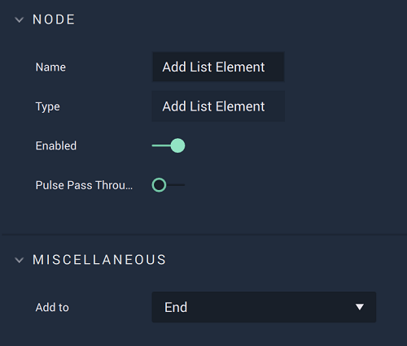

# Overview

The **Add List Element Node** adds an element to either the beginning or end of a **List**.

[**Scope**](../../overview.md#scopes): **Scene**, **Function**, **Prefab**.

# Attributes

|Attribute|Type|Description|
|---|---|---|
|`Add to`|**Dropdown**|The two options decide whether the element will be added to the `Beginning` or `End` of the **List**.|

# Inputs

|Input|Type|Description|
|---|---|---|
|*Pulse Input* (►)|**Pulse**|A standard **Input Pulse**, to trigger the execution of the **Node**.|
|`Object ID`|**ObjectID**|The **List** the user wishes to add the element to.|
|`Icon Path`|**String**||
|`Text`|**String**||

# Outputs

|Output|Type|Description|
|---|---|---|
|*Pulse Output* (►)|**Pulse**|A standard **Output Pulse**, to move onto the next **Node** along the **Logic Branch**, once this **Node** has finished its execution.|

# See Also

* [**Remove List Element**](removelistelement.md)

