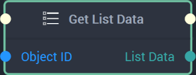

# Overview

The **Get List Data Node** returns the data of a **List** in **Array** format.

[**Scope**](../../overview.md#scopes): **Scene**, **Function**, **Prefab**.

# Inputs

|Input|Type|Description|
|---|---|---|
|*Pulse Input* (►)|**Pulse**|A standard **Input Pulse**, to trigger the execution of the **Node**.|
|`Object ID`|**ObjectID**|The **Object ID** of the **List** from which the data will be retrieved.|

# Outputs

|Output|Type|Description|
|---|---|---|
|*Pulse Output* (►)|**Pulse**|A standard **Output Pulse**, to move onto the next **Node** along the **Logic Branch**, once this **Node** has finished its execution.|
|`List Data`|**Array**|The data from the desired **List** in **Array** format.|

# See Also

* [**Set List Data**](setlistdata.md)

