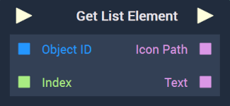

# Overview

The **Get List Element Node** returns the element of a **List** at the specified `Index`.

[**Scope**](../../overview.md#scopes): **Scene**, **Function**, **Prefab**.

# Inputs

|Input|Type|Description|
|---|---|---|
|*Pulse Input* (►)|**Pulse**|A standard **Input Pulse**, to trigger the execution of the **Node**.|
|`Object ID`|**ObjectID**|The desired **List** of the user.|
|`Index`|**Int**|The index of the element the user wishes to return.|

# Outputs

|Output|Type|Description|
|---|---|---|
|*Pulse Output* (►)|**Pulse**|A standard **Output Pulse**, to move onto the next **Node** along the **Logic Branch**, once this **Node** has finished its execution.|
|`Icon Path`|**String**||
|`Text`|**String**||

# See Also

* [**Set List Element**](setlistelement.md)

