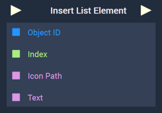

# Overview

The **Insert List Element Node** inserts an element into a **List** at the specified `Index`. Each element consists of two parts: the icon and the text. 

[**Scope**](../../overview.md#scopes): **Scene**, **Function**, **Prefab**.

# Inputs

|Input|Type|Description|
|---|---|---|
|*Pulse Input* (►)|**Pulse**|A standard **Input Pulse**, to trigger the execution of the **Node**.|
|`Object ID`|**ObjectID**|The **List** the user wishes to insert an element to.|
|`Index`|**Int**|The index that the element will be inserted at.|
|`Icon Path`|**String**|The path on the user's local machine which locates the desired icon image to be inserted.|
|`Text`|**String**|The text of the element to be inserted.|

# Outputs

|Output|Type|Description|
|---|---|---|
|*Pulse Output* (►)|**Pulse**|A standard **Output Pulse**, to move onto the next **Node** along the **Logic Branch**, once this **Node** has finished its execution.|

# See Also

* [**Remove List Element**](removelistelement.md)

