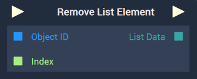

# Overview

The **Remove List Element Node** removes the element of a **List** at the specifed `Index` and returns the updated **List**. Each element consists of two parts: the icon and the text. 

[**Scope**](../../overview.md#scopes): **Scene**, **Function**, **Prefab**.

# Inputs

|Input|Type|Description|
|---|---|---|
|*Pulse Input* (►)|**Pulse**|A standard **Input Pulse**, to trigger the execution of the **Node**.|
|`Object ID`|**ObjectID**|The **List** the user wishes to remove an element from.|
|`Index`|**Int**|The index of the element the user wishes to remove.|

# Outputs

|Output|Type|Description|
|---|---|---|
|*Pulse Output* (►)|**Pulse**|A standard **Output Pulse**, to move onto the next **Node** along the **Logic Branch**, once this **Node** has finished its execution.|
|`List Data`|**Array**|The *JSON* data of the updated **List** in **Array** format.|

# See Also

* [**Add List Element**](addlistelement.md)
* [**Insert List Element**](insertlistelement.md)

