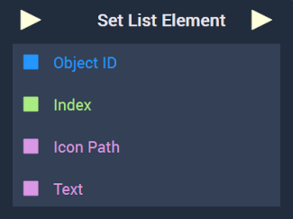

# Overview

The **Set List Element Node** sets a **List's** at the specified `Index`.

[**Scope**](../../overview.md#scopes): **Scene**, **Function**, **Prefab**.

# Inputs

|Input|Type|Description|
|---|---|---|
|*Pulse Input* (►)|**Pulse**|A standard **Input Pulse**, to trigger the execution of the **Node**.|
|`Object ID`|**ObjectID**|The **List** the user wishes to set the element for.|
|`Index`|**Int**|The index at which the element should be set.|
|`Icon Path`|**String**||
|`Text`|**String**||

# Outputs

|Output|Type|Description|
|---|---|---|
|*Pulse Output* (►)|**Pulse**|A standard **Output Pulse**, to move onto the next **Node** along the **Logic Branch**, once this **Node** has finished its execution.|

# See Also

* [**Remove List Element**](removelistelement.md)

