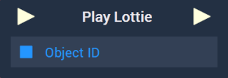

# Overview

The **Play Lottie** **Node** starts playing a *lottie*. It receives as input the **Object ID** of the **Lottie Sprite** **Object** to be played.

# Inputs

|Input|Type|Description|
|---|---|---|
|*Pulse Input* (►)|**Pulse**|A standard **Input Pulse**, to trigger the execution of the **Node**.|
| `Object ID` | **ObjectID** | The **Object ID** of the **Lottie Sprite** to be played. |

# Outputs

|Output|Type|Description|
|---|---|---|
|*Pulse Output* (►)|**Pulse**|A standard **Output Pulse**, to move onto the next **Node** along the **Logic Branch**, once this **Node** has finished its execution.|

# See Also

* [**Pause Lottie**](pause-lottie.md)
* [**Stop Lottie**](stop-lottie.md)
* [**Lottie Sprite**](../../../objects-and-types/scene-objects/lottie-sprite.md)

# External Links

* [What is a Lottie?](https://lottiefiles.com/what-is-lottie) on LottieFiles.
