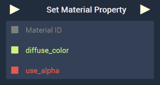
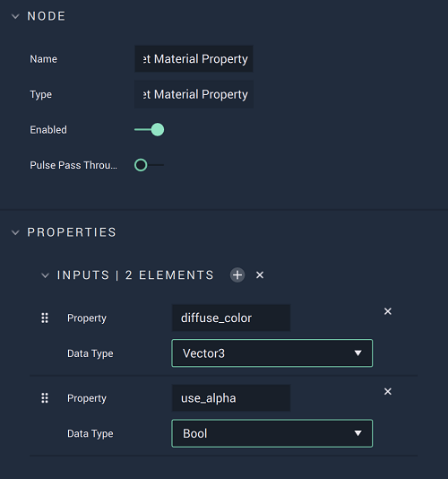

# Overview

The **Set Material Property Node** sets a property, or properties, of a **Material**. These properties are given their defining names in the **Attributes**. The names can be found by hovering over an **Attribute** of any of the **Shading Models** found in the [**Material Editor**](../../../modules/material-editor/README.md), copying it, and pasting it here. The **Node** pictured above shows two possible inputs. 

Some examples of these property names are: 

|Attribute|Property Name|
|---|---|
|Albedo|base_coat_albedo|
|Environment Map|environment_map|
| Use Alpha|use_alpha|
|Blending|diffuse_map_blending|

[**Scope**](../../overview.md#scopes): **Scene**, **Function**, **Prefab**

# Attributes

|Attribute|Type|Description|
|---|---|---|
|`Property`|**String**|Each `Property Element` is split into two parts, with `Property` being the first. This is the defining name of the **Material** property that will be set. There is an established naming convention which can be found by hovering over the **Attributes** of a **Shading Model**.|
|`Data Type`|**Dropdown**|Each `Property Element` is split into two parts, with `Data Type` being the second. The data type of the property.|

# Inputs

|Input|Type|Description|
|---|---|---|
|*Pulse Input* (►)|**Pulse**|A standard **Input Pulse**, to trigger the execution of the **Node**.|
|`Material`|**MaterialID**|The ID of the **Material** whose property, or properties, will be set.|
|`PROPERTY`|Determined by **Attribute**|A new input will show when one is added in the **Attributes**. Its data type and name will match that set in the the input element.|

# Outputs

|Output|Type|Description|
|---|---|---|
|*Pulse Output* (►)|**Pulse**|A standard **Output Pulse**, to move onto the next **Node** along the **Logic Branch**, once this **Node** has finished its execution.|

# See Also

* [**Get Material Property**](getmaterialproperty.md)
