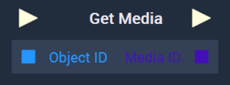

# Overview

The **Get Media Node** returns the **Media Asset** of an **Object**. This would either be a **Video** or **Audio Asset**.  

[**Scope**](../../overview.md#scopes): **Scene**, **Function**, **Prefab**.

# Inputs

|Input|Type|Description|
|---|---|---|
|*Pulse Input* (►)|**Pulse**|A standard **Input Pulse**, to trigger the execution of the **Node**.|
|`Object ID`|**ObjectID**|The ID of the **Media Object**.|

# Outputs

|Output|Type|Description|
|---|---|---|
|*Pulse Output* (►)|**Pulse**|A standard **Output Pulse**, to move onto the next **Node** along the **Logic Branch**, once this **Node** has finished its execution.|
|`Media ID`|**MediaID**|The returned ID of the **Media Asset** that is set to the **Media Object**.

# See Also

* [**Set Media**](setmedia.md)

