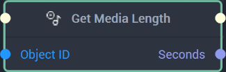
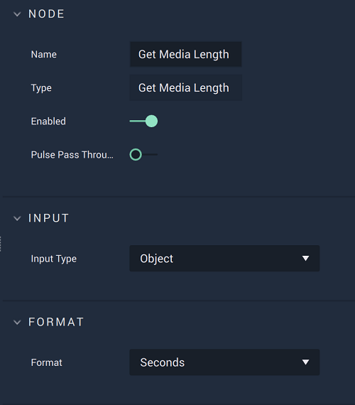

# Overview

The **Get Media Length Node** returns the duration of a **Media Object** or **Asset** either in `Seconds` (**Video** & **Audio**) or in `Frames` (**Video** only). The **Node's** input and output change depending on what is selected in its **Attributes**.

[**Scope**](../../overview.md#scopes): **Scene**, **Function**, **Prefab**.

# Attributes

|Attribute|Type|Description|
|---|---|---|
|`Input Type`|**Dropdown**|Gives the options for the **Node's** input type. It can be either `Object` or `Asset`. Selecting `Object` will lead to an `Object ID` input. Selecting `Asset` will lead to a `Media ID` input.|
|`Format`|**Dropdown**|Gives the options for the **Node's** output type. It can be either `Seconds` or `Frames`.|

# Inputs

The **Attributes** decide whether `Object ID` or `Media ID` appears as input.




|Input|Type|Description|
|---|---|---|
|*Pulse Input* (►)|**Pulse**|A standard **Input Pulse**, to trigger the execution of the **Node**.|
|`Object ID`|**ObjectID**|The ID of the desired **Media Object** whose duration length will be returned. |





|Input|Type|Description|
|---|---|---|
|*Pulse Input* (►)|**Pulse**|A standard **Input Pulse**, to trigger the execution of the **Node**.|
|`Media ID`|**AssetID**|The ID of the desired **Media Asset** whose duration length will be returned.|




# Outputs

The **Attributes** decide whether `Seconds` or `Frames` appears as output. 




|Output|Type|Description|
|---|---|---|
|*Pulse Output* (►)|**Pulse**|A standard **Output Pulse**, to move onto the next **Node** along the **Logic Branch**, once this **Node** has finished its execution.|
|`Seconds`|**Float**|The duration in seconds.|





|Output|Type|Description|
|---|---|---|
|*Pulse Output* (►)|**Pulse**|A standard **Output Pulse**, to move onto the next **Node** along the **Logic Branch**, once this **Node** has finished its execution.|
|`Frames`|**Int**|The duration in frames.|




# See Also

* [**Media**](README.md)
* [**Video**](../../../objects-and-types/scene-objects/3dobjects/video.md)
* [**Audio**](../../../objects-and-types/scene-objects/audio.md)

