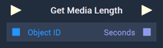

# Overview

The **Get Media Length Node** returns the duration of a **Media Object** or **Asset** either in `Seconds` (Video & Audio) or in `Frames` (Video only). The **Node's** input and output changes depending on what is selected in its **Attributes**.

[**Scope**](../../overview.md#scopes): **Scene**, **Function**, **Prefab**.

# Attributes

|Attribute|Type|Description|
|---|---|---|
|`Input Type`|**Dropdown**|Gives the options for the **Node's** input type. It can be either `Object` or `Asset`. Selecting `Object` will lead to an `Object ID` input. Selecting `Asset` will lead to a `Media ID` input.|
|`Format`|**Dropdown**|Gives the options for the **Node's** output type. It can be either `Seconds` or `Frames`. Selecting `Seconds` will lead to a `Seconds` output. Selecting `Frames` will lead to a `Frames` output.|

# Inputs

|Input|Type|Description|
|---|---|---|
|*Pulse Input* (►)|**Pulse**|A standard **Input Pulse**, to trigger the execution of the **Node**.|
|`Object ID`|**ObjectID**|The ID of the desired **Object**. Please note that this appears only when `Object` is selected in the **Attributes**.|
|`Asset ID`|**AssetID**|The ID of the desired **Asset**. Please note that this appears only when `Asset` is selected in the **Attributes**.|

# Outputs

|Output|Type|Description|
|---|---|---|
|*Pulse Output* (►)|**Pulse**|A standard **Output Pulse**, to move onto the next **Node** along the **Logic Branch**, once this **Node** has finished its execution.|
|`Seconds`|**Float**|The duration in seconds. Please note that this appears only when `Seconds` is selected in the **Attributes**.|
|`Frames`|**Int**|The duration in frames. Please note that this appears only when `Frames` is selected in the **Attributes**.

# See Also

