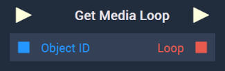

# Overview

The **Get Media Loop Node** returns the value of the `Loop` **Bool**. *True* means that the **Media Object** should restart after it finishes and *false* means that it shouldn’t. 

[**Scope**](../../overview.md#scopes): **Scene**, **Function**, **Prefab**. 

# Inputs

|Input|Type|Description|
|---|---|---|
|*Pulse Input* (►)|**Pulse**|A standard **Input Pulse**, to trigger the execution of the **Node**.|
|`Object ID`|**ObjectID**|The ID of the desired **Object**.|

# Outputs

|Output|Type|Description|
|---|---|---|
|*Pulse Output* (►)|**Pulse**|A standard **Output Pulse**, to move onto the next **Node** along the **Logic Branch**, once this **Node** has finished its execution.|
|`Loop`|**Bool**|Returns *true* or *false* if the inputted **Media Object** loops or not.|

# See Also

* [**Set Media Loop**](setmedialoop.md)

