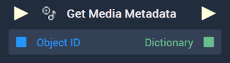
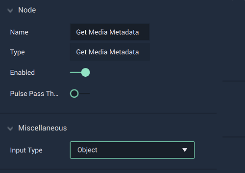
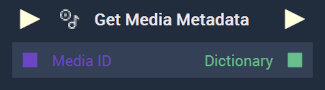

This **Node** can be used to get the metadata of a **Media** **Object**. It has two different versions depending on the `Input Type` chosen. Find in the tabs below the documentation for all versions.




# Overview

The **Get Media Metadata Node** returns the *ID3* *metadata* from hard drive media, such as *.mp3* files, in **Dictionary** format. More information on *ID3* can be found [here](https://en.wikipedia.org/wiki/ID3). Please note that videos do not have *metadata* and thus are not compatible with this **Node**.

*ID3 tags* can be investigated more in depth [here](https://exiftool.org/TagNames/ID3.html). 

[**Scope**](../../overview.md#scopes): **Scene**, **Function**, **Prefab**.

## Attributes

|Attribute|Type|Description|
|---|---|---|
|`Input Type`|**Dropdown**|The type of the inputted item. It can be either an **Object** or an **Asset**. Here, **Object** is selected.|

# Inputs

|Input|Type|Description|
|---|---|---|
|*Pulse Input* (►)|**Pulse**|A standard **Input Pulse**, to trigger the execution of the **Node**.|
|`Object ID`|**ObjectID**|The ID of the desired **Media Object**.|

# Outputs

|Output|Type|Description|
|---|---|---|
|*Pulse Output* (►)|**Pulse**|A standard **Output Pulse**, to move onto the next **Node** along the **Logic Branch**, once this **Node** has finished its execution.|
|`Dictionary`|**Dictionary**|The returned **Dictionary** containing the **Object's** *metadata*.|





# Overview

The **Get Media Metadata Node** returns the *ID3* *metadata* from hard drive media, such as *.mp3* files, in **Dictionary** format. More information on *ID3* can be found [here](https://en.wikipedia.org/wiki/ID3). Please note that videos do not have *metadata* and thus are not compatible with this **Node**.

*ID3 tags* can be investigated more in depth [here](https://exiftool.org/TagNames/ID3.html). 

[**Scope**](../../overview.md#scopes): **Scene**, **Function**, **Prefab**.

## Attributes

|Attribute|Type|Description|
|---|---|---|
|`Input Type`|**Dropdown**|The type of the inputted item. It can be either an **Object** or an **Asset**. Here, **Asset** is selected.|

# Inputs

|Input|Type|Description|
|---|---|---|
|*Pulse Input* (►)|**Pulse**|A standard **Input Pulse**, to trigger the execution of the **Node**.|
|`Media ID`|**MediaID**|The ID of the desired **Media Asset**.|

# Outputs

|Output|Type|Description|
|---|---|---|
|*Pulse Output* (►)|**Pulse**|A standard **Output Pulse**, to move onto the next **Node** along the **Logic Branch**, once this **Node** has finished its execution.|
|`Dictionary`|**Dictionary**|The returned **Dictionary** containing the **Asset's** *metadata*.|



