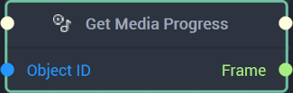
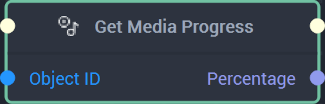
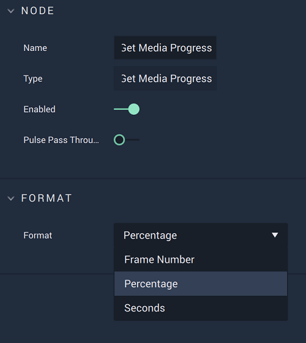
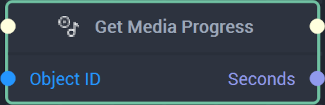
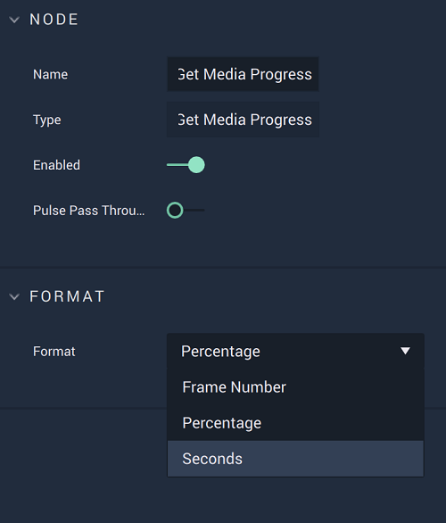

This **Node** can be used to navigate to a particular point of a **Media** **Object**. It has three different versions depending on the `Format` chosen. Find in the tabs below the documentation for all versions.




## Overview

The **Get Media Progress Node** returns the partial duration of time that has progressed out of a **Media Object’s** temporal entirety in either `Frames`, `Seconds`, or a `Percentage`. 

[**Scope**](../../overview.md#scopes): **Scene**, **Function**, **Prefab**. 

## Attributes

|Attribute|Type|Description|
|---|---|---|
|`Format`|**Dropdown**|The desired format of the time segment. It can be either `Frame Number`, `Percentage`, or `Seconds`. Here, `Frame Number` is chosen.|

## Inputs

|Input|Type|Description|
|---|---|---|
|*Pulse Input* (►)|**Pulse**|A standard **Input Pulse**, to trigger the execution of the **Node**.|
|`Object ID`|**ObjectID**|The ID of the desired **Media Object**. |

## Outputs

|Output|Type|Description|
|---|---|---|
|*Pulse Output* (►)|**Pulse**|A standard **Output Pulse**, to move onto the next **Node** along the **Logic Branch**, once this **Node** has finished its execution.|
|`Frame Number`|**Int**|The returned partial duration of time in frames, only if `Frame Number` is selected in the **Attributes**.|





## Overview

The **Get Media Progress Node** returns the partial duration of time that has progressed out of a **Media Object’s** temporal entirety in either `Frames`, `Seconds`, or a `Percentage`. 

[**Scope**](../../overview.md#scopes): **Scene**, **Function**, **Prefab**. 

## Attributes

|Attribute|Type|Description|
|---|---|---|
|`Format`|**Dropdown**|The desired format of the time segment. It can be either `Frame Number`, `Percentage`, or `Seconds`. Here, `Percentage` is chosen.|

## Inputs

|Input|Type|Description|
|---|---|---|
|*Pulse Input* (►)|**Pulse**|A standard **Input Pulse**, to trigger the execution of the **Node**.|
|`Object ID`|**ObjectID**|The ID of the desired **Media Object**. |

## Outputs

|Output|Type|Description|
|---|---|---|
|*Pulse Output* (►)|**Pulse**|A standard **Output Pulse**, to move onto the next **Node** along the **Logic Branch**, once this **Node** has finished its execution.|
|`Percentage`|**Float**|The returned partial duration of time as a percentage, only if `Percentage` is selected in the **Attributes**.|





## Overview

The **Get Media Progress Node** returns the partial duration of time that has progressed out of a **Media Object’s** temporal entirety in either `Frames`, `Seconds`, or a `Percentage`. 

[**Scope**](../../overview.md#scopes): **Scene**, **Function**, **Prefab**. 

## Attributes

|Attribute|Type|Description|
|---|---|---|
|`Format`|**Dropdown**|The desired format of the time segment. It can be either `Frame Number`, `Percentage`, or `Seconds`. Here, `Seconds` is chosen.|

## Inputs

|Input|Type|Description|
|---|---|---|
|*Pulse Input* (►)|**Pulse**|A standard **Input Pulse**, to trigger the execution of the **Node**.|
|`Object ID`|**ObjectID**|The ID of the desired **Media Object**. |

## Outputs

|Output|Type|Description|
|---|---|---|
|*Pulse Output* (►)|**Pulse**|A standard **Output Pulse**, to move onto the next **Node** along the **Logic Branch**, once this **Node** has finished its execution.|
|`Seconds`|**Float**|The returned partial duration of time in seconds, only if `Seconds` is selected in the **Attributes**.|




# See Also

* [Set Media Progress](setmediaprogress.md)

