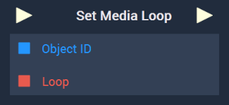
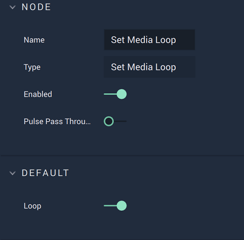

# Overview

The **Set Media Loop Node** sets the `Loop` **Bool** for a **Media Object** to either *true* or *false*. *True* means that the **Media** restarts when it finishes, *false* means that it doesn’t.

[**Scope**](../../overview.md#scopes): **Scene**, **Function**, **Prefab**. 

# Attributes

|Attribute|Type|Description|
|---|---|---|
|`Loop`|**Bool**|The **Bool** that sets the **Media Object** to loop or not, if nothing is provided in the **Input Socket**. When toggled on, the **Media Object** will be set to restart when it finishes. When toggled off, the **Media Object** will be set to finish at its end.|

# Inputs

|Input|Type|Description|
|---|---|---|
|*Pulse Input* (►)|**Pulse**|A standard **Input Pulse**, to trigger the execution of the **Node**.|
|`Object ID`|**ObjectID**|The **Media Object** for which the `Loop` **Bool** will be set.|
|`Loop`|**Bool**|Sets `Loop` to *true* or *false*. | 

# Outputs

|Output|Type|Description|
|---|---|---|
|*Pulse Output* (►)|**Pulse**|A standard **Output Pulse**, to move onto the next **Node** along the **Logic Branch**, once this **Node** has finished its execution.|

# See Also

* [**Get Media Loop**](getmedialoop.md)

