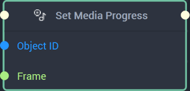
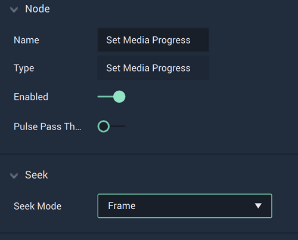
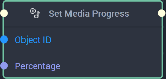
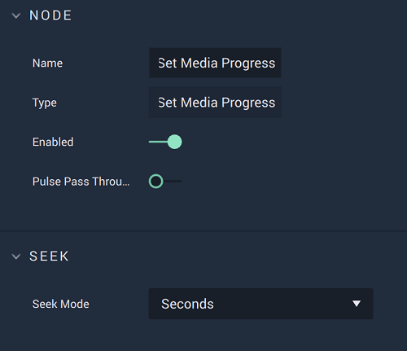
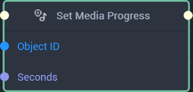

This **Node** can be used to navigate to a particular point of a **Media** **Object**. It has three different versions depending on the `Format` chosen. Find in the tabs below the documentation for all versions.




## Overview

The **Set Media Progress Node** is used to navigate to a particular point of a **Media Object’s** progress in either `Frame Numbers`, `Percentage`, or `Seconds`.

[**Scope**](../../overview.md#scopes): **Scene**, **Function**, **Prefab**.

## Attributes

|Attribute|Type|Description|
|---|---|---|
|`Format`|**Dropdown**|The format to be used when setting the **Media’s** progress. This can be either `Seconds`, `Percentage` or `Frame Numbers`. Here, `Frame Numbers` is chosen.|

## Inputs

|Input|Type|Description|
|---|---|---|
|*Pulse Input* (►)|**Pulse**|A standard **Input Pulse**, to trigger the execution of the **Node**.|
|`Object ID`|**ObjectID**|The ID of the **Object** to have its progress set.|
|`Frame Number`|**Int**|The `Frame Number` that should be navigated to.|

## Outputs

|Output|Type|Description|
|---|---|---|
|*Pulse Output* (►)|**Pulse**|A standard **Output Pulse**, to move onto the next **Node** along the **Logic Branch**, once this **Node** has finished its execution.|





## Overview

The **Set Media Progress Node** is used to navigate to a particular point of a **Media Object’s** progress in either `Frame Numbers`, `Percentage`, or `Seconds`.

[**Scope**](../../overview.md#scopes): **Scene**, **Function**, **Prefab**.

## Attributes

<!--NEED UPDATED IMAGE THAT REMOVES SEEK-->

|Attribute|Type|Description|
|---|---|---|
|`Format`|**Dropdown**|The format to be used when setting the **Media’s** progress. This can be either `Seconds`, `Percentage`, or `Frame Numbers`. Here, `Percentage` is chosen.|

## Inputs

|Input|Type|Description|
|---|---|---|
|*Pulse Input* (►)|**Pulse**|A standard **Input Pulse**, to trigger the execution of the **Node**.|
|`Object ID`|**ObjectID**|The ID of the **Object** to have its progress set.|
|`Percentage`|**Float**|The `Percentage` value that should be navigated to.|

## Outputs

|Output|Type|Description|
|---|---|---|
|*Pulse Output* (►)|**Pulse**|A standard **Output Pulse**, to move onto the next **Node** along the **Logic Branch**, once this **Node** has finished its execution.|





## Overview

The **Set Media Progress Node** is used to navigate to a particular point of a **Media Object’s** progress in either `Frame Numbers`, `Percentage`, or `Seconds`.

[**Scope**](../../overview.md#scopes): **Scene**, **Function**, **Prefab**.

## Attributes

<!--NEED UPDATED IMAGE THAT REMOVES SEEK-->

|Attribute|Type|Description|
|---|---|---|
|`Format`|**Dropdown**|The format to be used when setting the **Media’s** progress. This can be either `Seconds`, `Percentage`, or `Frame Numbers`. Here, `Seconds` is chosen.|

## Inputs

|Input|Type|Description|
|---|---|---|
|*Pulse Input* (►)|**Pulse**|A standard **Input Pulse**, to trigger the execution of the **Node**.|
|`Object ID`|**ObjectID**|The ID of the **Object** to have its progress set.|
|`Seconds`|**Float**|The `Seconds` value that should be navigated to.|

## Outputs

|Output|Type|Description|
|---|---|---|
|*Pulse Output* (►)|**Pulse**|A standard **Output Pulse**, to move onto the next **Node** along the **Logic Branch**, once this **Node** has finished its execution.|




# See Also

* [**Get Media Progress**](getmediaprogress.md)

