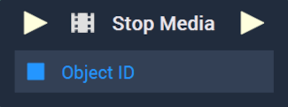

# Overview

The **Stop Media Node** can be used to stop a media **Object** already playing during the session. Media in **Incari** is either a [**Video**](../../../objects-and-types/scene-objects/3dobjects/video.md) or an [**Audio**](../../../objects-and-types/scene-objects/audio.md). 

[**Scope**](../../overview.md#scopes): **Scene**, **Function**, **Prefab**.

# Inputs

|Input|Type|Description|
|---|---|---|
|*Pulse Input* (►)|**Pulse**|A standard **Input Pulse**, to trigger the execution of the **Node**.|
| `Object ID` | **ObjectID** | The ID of the media **Object** to be stopped. |

# Outputs

|Output|Type|Description|
|---|---|---|
|*Pulse Output* (►)|**Pulse**|A standard **Output Pulse**, to move onto the next **Node** along the **Logic Branch**, once this **Node** has finished its execution.|

# See Also

* [**Is Media Playing**](ismediaplaying.md)
* [**Pause Media**](pausemedia.md)
* [**Play Media**](playmedia.md)
