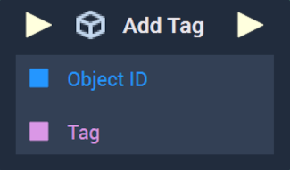
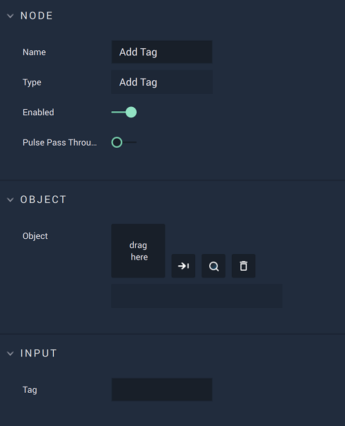

# Overview

The **Add Tag Node** attaches a *tag* to an **Object**. This *tag* acts as *metadata* and can be used later to identify many **Objects** by a shared *tag*. 

It is important to note that when a *tag* is added with the **Add Tag Node**, the *tag* is only added once executed in the **Incari Player** and does not interact in any way with the *tags* added in the `Attributes` of an **Object** in **Incari Studio**. For example, this **Node** could be used for an **Object** created on runtime. 

# Attributes

## Object

|Attribute|Type|Description|
|---|---|---|
|`Object`| **ObjectID** |The **Object** that the *tag* will be added to, if one is not provided in the **Input Socket**.|

## Input

|Attribute|Type|Description|
|---|---|---|
| `Tag` | **String** |The *tag* to be added to the selected **Object**, if one is not provided in the **Input Socket**.|

# Inputs

|Input|Type|Description|
|---|---|---|
|*Pulse Input* (►)|**Pulse**|A standard **Input Pulse**, to trigger the execution of the **Node**.|
| `Object ID` | **ObjectID** |The **Object** that the *tag* will be added to.|
| `Tag` | **String** |The *tag* to be added to the selected **Object**.|

# Outputs

|Output|Type|Description|
|---|---|---|
|*Pulse Output* (►)|**Pulse**|A standard **Output Pulse**, to move onto the next **Node** along the **Logic Branch**, once this **Node** has finished its execution.|

# See Also

* [**Remove Tag**](remove-tag.md)
* [**Get Objects By Tag**](get-objects-by-tag.md)

