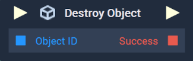
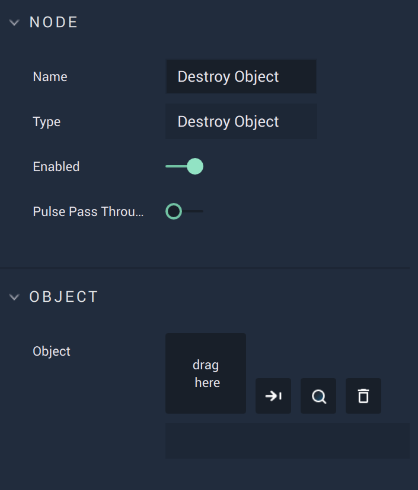

# Overview

The **Destroy Object Node** deletes an **Object** or **Prefab Instance**, the latter of which means that the **Prefab** in the **Asset Manager** remains. All the children are destroyed as well.  

# Attributes

|Attribute|Type|Description|
|---|---|---|
|`Object`|**ObjectID**|The **Object** to delete, if one is not provided in the **Input Socket**.|

# Inputs

|Input|Type|Description|
|---|---|---|
|*Pulse Input* (►)|**Pulse**|A standard **Input Pulse**, to trigger the execution of the **Node**.|
|`Object ID`|**ObjectID**|The **Object** to delete.|

# Outputs

|Output|Type|Description|
|---|---|---|
|*Pulse Output* (►)|**Pulse**|A standard **Output Pulse**, to move onto the next **Node** along the **Logic Branch**, once this **Node** has finished its execution.|
|`Success`|**Bool**|Returns *true* or *false*, depending on whether the **Object** was successfully deleted or not.|

# See Also

* [**Instantiate Object**](instantiate.md)