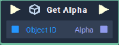

# Overview

**Get Alpha** returns the *alpha* value of the color space of an **Object** in a **Scene**. The **Object ID** is given as input to the **Node**. 

The **Get Alpha** node only works with objects that have **Sprite** category as an attribute such as **List**, **Image**, **Sequence**, **Web Sprite**, **Sprite** and **Text**.

# Attributes

|Attribute|Type|Description|
|---|---|---|
|`Object`|**ObjectID**|The **Object** that you wish to return the `alpha` component of, if one is not provided in the `object ID` **Socket**.

# Inputs

|Input|Type|Description|
|---|---|---|
|*Pulse Input* (►)|**Pulse**|A standard **Input Pulse**, to trigger the execution of the **Node**.|
|`Object`|**ObjectID** |The ID of the **Object** whose color space's *alpha* value is to be determined.

# Outputs

|Output|Type|Description|
|---|---|---|
|*Pulse Output* (►)|**Pulse**|A standard **Output Pulse**, to move onto the next **Node** along the **Logic Branch**, once this **Node** has finished its execution.|
|`Alpha`| Float | The desired *alpha* value.

# See Also
[**Set Alpha**](set-alpha.md)

# External Links
- [*Alpha value*](https://en.wikipedia.org/wiki/Alpha_compositing)

