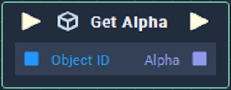
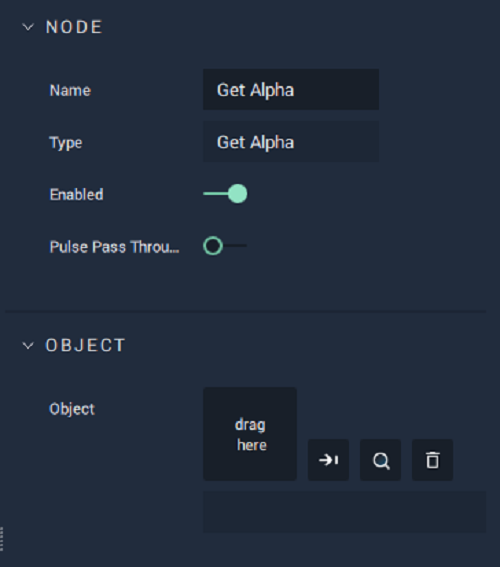

# Get Alpha

## Overview

**Get Alpha** returns the _alpha_ value of the color space of an **Object** in a **Scene**. The **Object ID** is given as input to the **Node**.

The **Get Alpha** **Node** only works with **Objects** that have **Attributes** from the **Sprite** category, such as [**List**](../../../getting-started/scene-objects/list-widget.md), **Image Sequence**, **Web Sprite**, [**Sprite**](../../../getting-started/scene-objects/sprite.md), and [**Text**](../../../getting-started/scene-objects/text.md).

## Attributes

| Attribute | Type | Description |
| :--- | :--- | :--- |
| `Object` | **ObjectID** | The **Object**, whose `Alpha` **Attribute** value you wish to return, if one is not provided in the `Object ID` **Socket**. |

## Inputs

| Input | Type | Description |
| :--- | :--- | :--- |
| _Pulse Input_ \(►\) | **Pulse** | A standard **Input Pulse**, to trigger the execution of the **Node**. |
| `Object ID` | **ObjectID** | The **Object** whose `Alpha` **Attribute** value you wish to return. |

## Outputs

| Output | Type | Description |
| :--- | :--- | :--- |
| _Pulse Output_ \(►\) | **Pulse** | A standard **Output Pulse**, to move onto the next **Node** along the **Logic Branch**, once this **Node** has finished its execution. |
| `Alpha` | Float | The _alpha_ value of the **Object**. |

## See Also

* [**Set Alpha**](set-alpha.md)

## External Links

* [_Alpha compositing_](https://en.wikipedia.org/wiki/Alpha_compositing) on Wikipedia.

