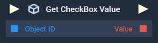

# Overview

The **Get CheckBox Value Node** returns a **Boolean** value of either *true* or *false*, depending on if the [**Toggle Object**](../../../objects-and-types/scene2d-objects/gui/toggle.md) given as input is checked on or not.

[**Scope**](../../overview.md#scopes): **Scene**, **Function**, **Prefab**.

# Inputs

|Input|Type|Description|
|---|---|---|
|*Pulse Input* (►)|**Pulse**|A standard **Input Pulse**, to trigger the execution of the **Node**.|
|`Object ID`|**ObjectID**|the **Toggle Object** from which the value is to be obtained.|

# Outputs

|Output|Type|Description|
|---|---|---|
|*Pulse Output* (►)|**Pulse**|A standard **Output Pulse**, to move onto the next **Node** along the **Logic Branch**, once this **Node** has finished its execution.|
|`Value`|**Boolean**|Returns *true* if the **Toggle Object** is checked on, or *false* if not.|

# See Also

* [**Set CheckBox Value**](set-checkbox-value.md)
* [**On CheckBox Value Change**](../../events/object/on-checkbox-value-change.md)

