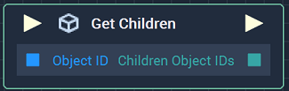
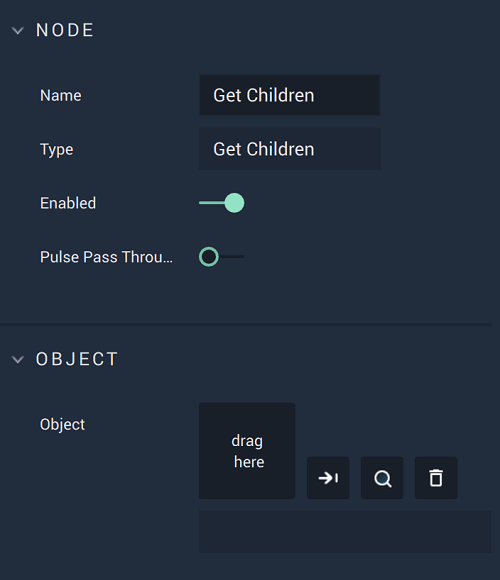

# Overview

The **Get Children Node** returns an **Array** of *children* **Object IDs** of a *parent* **Object**.

[**Scope**](../../overview.md#scopes): **Scene**, **Function**, **Prefab**.

# Attributes

|Attribute|Type|Description|
|---|---|---|
|`Object`|**ObjectID**|Sets the *parent* **Object** whose *children* **Object IDs** will be returned, if one is not provided in the **Input Socket**. 

# Inputs

|Input|Type|Description|
|---|---|---|
|*Pulse Input* (►)|**Pulse**|A standard **Input Pulse**, to trigger the execution of the **Node**.|
|`Object ID`|**ObjectID**|Sets the *parent* **Object** whose *children* **Object IDs** will be returned.|

# Outputs

|Output|Type|Description|
|---|---|---|
|*Pulse Output* (►)|**Pulse**|A standard **Output Pulse**, to move onto the next **Node** along the **Logic Branch**, once this **Node** has finished its execution.|
|`Children Object IDs`|**Array**|Returns an **Array** of the *children* **Object IDs**.|

# See Also

* [**Has Children**](has-children.md)
* [**Get Parent**](get-parent.md)
