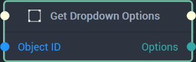

# Overview

**Get Dropdown Options** returns an **Array** of all of a [**Dropdown Object's**](../../../objects-and-types/scene2d-objects/gui/dropdown.md) `Options`.

[**Scope**](../../overview.md#scopes): **Scene**, **Function**, **Prefab**.

# Inputs

|Input|Type|Description|
|---|---|---|
|*Pulse Input* (►)|**Pulse**|A standard **Input Pulse**, to trigger the execution of the **Node**.|
|`Object ID`|**ObjectID**|The **Dropdown Object** whose `Options` will be returned.|

# Outputs

|Output|Type|Description|
|---|---|---|
|*Pulse Output* (►)|**Pulse**|A standard **Output Pulse**, to move onto the next **Node** along the **Logic Branch**, once this **Node** has finished its execution.|
|`Options`|**Array**|The `Options` of the inputted **Dropdown Object**.|

# See Also

* [**Set Dropdown Options**](set-dropdown-options.md)

