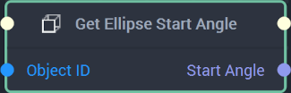

# Overview

The **Get Ellipse Start Angle Node** returns the `Start Angle` of an [**Ellipse**](../../../objects-and-types/scene2d-objects/figma/figmaellipse.md).

[**Scope**](../../overview.md#scopes): **Scene**, **Function**, **Prefab**.

# Inputs

|Input|Type|Description|
|---|---|---|
|*Pulse Input* (►)|**Pulse**|A standard **Input Pulse**, to trigger the execution of the **Node**.|
|`Object ID`|**ObjectID**|The **Ellipse Object** whose `Start Angle` will be returned.|

# Outputs

|Output|Type|Description|
|---|---|---|
|*Pulse Output* (►)|**Pulse**|A standard **Output Pulse**, to move onto the next **Node** along the **Logic Branch**, once this **Node** has finished its execution.|
|`Start Angle`|**Float**|The returned value of the `Start Angle`, representing degrees.|

# See Also

* [**Get Ellipse Arc Sector**](get-ellipse-arc-sector.md)
* [**Get Inner Radius**](get-inner-radius.md)
* [**Set Ellipse Arc Sector**](set-ellipse-arc-sector.md)
* [**Set Ellipse Start Angle**](set-ellipse-start-angle.md)
* [**Set Inner Radius**](set-inner-radius.md)

