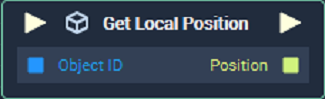
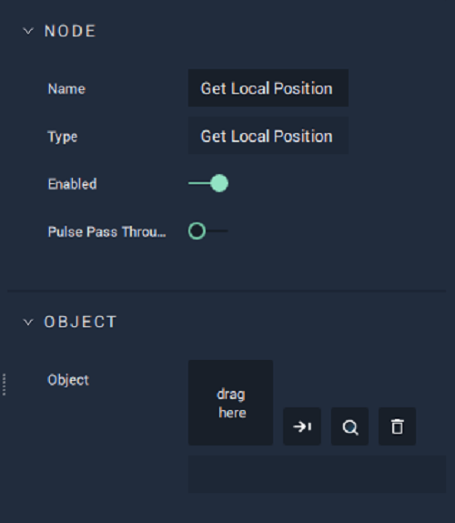

# Overview

The **Get Local Position Node** returns the *local position* of an **Object** in a **Scene**. The **Object ID** is given as input to the **Node**.

# Attributes

|Attribute|Type|Description|
|---|---|---|
|`Object`|**ObjectID**|The target **Object** whose local `Position` you wish to return, if one is not provided in the `Object ID` **Socket**.|

# Inputs

|Input|Type|Description|
|---|---|---|
|*Pulse Input* (►)|**Pulse**|A standard **Input Pulse**, to trigger the execution of the **Node**.|
| `Object ID` | **ObjectID** | The ID of the target **Object** whose local `Position` you wish to return. |

# Outputs

|Output|Type|Description|
|---|---|---|
|*Pulse Output* (►)|**Pulse**|A standard **Output Pulse**, to move onto the next **Node** along the **Logic Branch**, once this **Node** has finished its execution.|
| `Position` | **Vector3** | A 3-dimensional **Vector** that contains the X, Y, and Z _local position_ values of the target **Object**. |

# See Also

<!-- * [**Global and Local Transforms**]() -->
* [**Get Local Rotation**](get-local-rotation.md)
* [**Set Local Position**](set-local-position.md)
* [**Set Local Rotation**](set-local-rotation.md)

## External Links

* [_Position \(geometry\)_](https://en.wikipedia.org/wiki/Position_%28geometry%29) on Wikipedia.