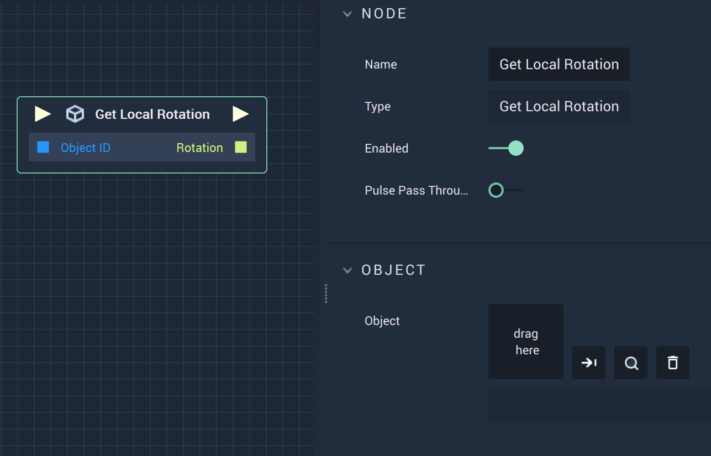

# Overview

The **Get Local Rotation Node** returns the local coordinates (in reference to the **Object** itself)  for a **3D Object's** *local rotation* in **Vector3** form. 

# Attributes

|Attribute|Type|Description|
|---|---|---|
|`Object`|**ObjectID**|The target **Object** whose `Local Rotation` you wish to return, if one is not provided in the `Object ID` **Socket**.|

# Inputs

|Input|Type|Description|
|---|---|---|
|*Pulse Input* (►)|**Pulse**|A standard **Input Pulse**, to trigger the execution of the **Node**.|
| `Object ID` | **ObjectID** | The ID of the target **Object** whose `Local Rotation` you wish to return. |

# Outputs

|Output|Type|Description|
|---|---|---|
|*Pulse Output* (►)|**Pulse**|A standard **Output Pulse**, to move onto the next **Node** along the **Logic Branch**, once this **Node** has finished its execution.|
| `Rotation` | **Vector3** | A 3-dimensional **Vector** that contains the X and Y and Z _local rotation_ values of the target **Object**. |

# See Also

