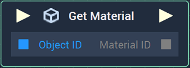
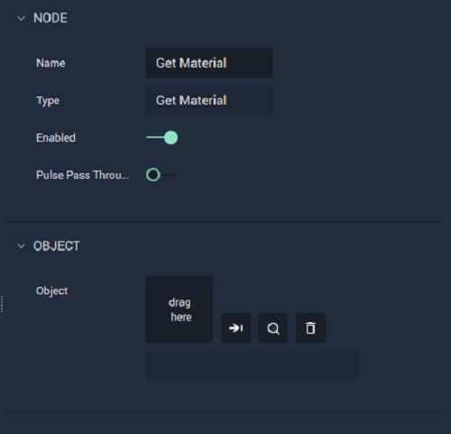

# Get Material

## Overview

**Get Material** returns the assigned **Material** of a [**Mesh Object**](../../../objects-and-types/scene-objects/mesh.md).

[**Scope**](../../overview.md#scopes): **Scene**, **Function**, **Prefab**.

## Attributes

| Attribute | Type | Description |
| :--- | :--- | :--- |
| `Object` | **ObjectID** | The **Mesh Object**, whose allocated **Material** you wish to return, if one is not provided in the `Object ID` **Socket**. |

## Inputs

| Input | Type | Description |
| :--- | :--- | :--- |
| _Pulse Input_ \(►\) | **Pulse** | A standard **Input Pulse**, to trigger the execution of the **Node**. |
| `Object ID` | **ObjectID** | The **Mesh Object** whose allocated **Material** you wish to return. |

## Outputs

| Output | Type | Description |
| :--- | :--- | :--- |
| _Pulse Output_ \(►\) | **Pulse** | A standard **Output Pulse**, to move onto the next **Node** along the **Logic Branch**, once this **Node** has finished its execution. |
| `Material ID` | **CustomID** | The assigned **Material** of the **Mesh Object**. |

## See Also

* [**Set Material**](set-material.md)
* [**Mesh**](../../../objects-and-types/scene-objects/mesh.md)

