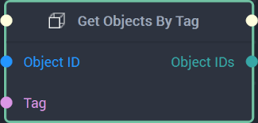
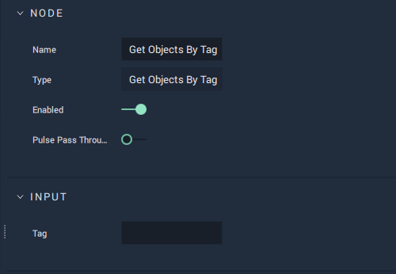

# Overview

The **Get Objects By Tag Nodes** returns an **Array** of all **Objects**, specifically their **IDs**, which are associated with the given *tag* and fall under the *subtree* of a given **Object**. If no **Object** is given as input, it defaults to the **Root Object**, thus performing the search on the whole **Scene**. 

To learn more about the **Root Object** and **Scene** structure, click [here.](../../../objects-and-types/scene-objects/README.md#structure-in-a-scene)

[**Scope**](../../overview.md#scopes): **Scene**, **Function**, **Prefab**.

# Attributes

## Input

|Attribute|Type|Description|
|---|---|---|
| `Tag` | **String** |The *tag* of interest, if one is not provided in the **Input Socket**.|

# Inputs

|Input|Type|Description|
|---|---|---|
|*Pulse Input* (►)|**Pulse**|A standard **Input Pulse**, to trigger the execution of the **Node**.|
|`Object ID`|**ObjectID**| The *root* **Object** of the *subtree* in which the search will be performed. The default, if nothing is received, is the **Root Object**.|
|`Tag`|**String**|The *tag* of interest.|

# Outputs

|Output|Type|Description|
|---|---|---|
|*Pulse Output* (►)|**Pulse**|A standard **Output Pulse**, to move onto the next **Node** along the **Logic Branch**, once this **Node** has finished its execution.|
|`Object IDs`|**ObjectID**|An **Array** of all the **Object IDs** with the associated *tag*.| 

# See Also

* [**Add Tag**](add-tag.md)
* [**Remove Tag**](remove-tag.md)
* [**Get Tag**](get-tag.md)

