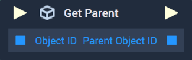
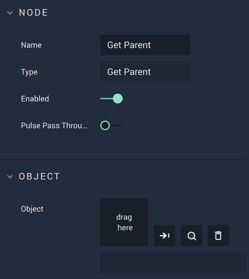

# Overview

The **Get Parent Node** returns the **Object ID** of an **Object's** *parent*. If an **Object** has no explicit *parent* given by the user, the ID of the **Root Object** is returned. In **Incari**, every **Object** has a *parent*, with the **Root Object** being the *parent* of all **Objects** on the highest level. 

To learn more about the **Root Object** and **Scene** structure, click [here.](../../../objects-and-types/scene-objects/README.md#structure-in-a-scene)

[**Scope**](../../overview.md#scopes): **Scene**, **Function**, **Prefab**.

# Attributes

|Attribute|Type|Description|
|---|---|---|
|`Object ID`|**ObjectID**|Sets the *child* **Object** whose *parent* **Object ID** will be returned, if one is not provided in the **Input Socket**. |

# Inputs

|Input|Type|Description|
|---|---|---|
|*Pulse Input* (►)|**Pulse**|A standard **Input Pulse**, to trigger the execution of the **Node**.|
|`Object ID`|**ObjectID**|Sets the *child* **Object** whose *parent* **Object ID** will be returned. 

# Outputs

|Output|Type|Description|
|---|---|---|
|*Pulse Output* (►)|**Pulse**|A standard **Output Pulse**, to move onto the next **Node** along the **Logic Branch**, once this **Node** has finished its execution.|
|`Parent Object ID`|**ObjectID**|Returns the **ID** of the *parent* **Object**.

# See Also

* [**Get Children**](get-children.md)
* [**Has Children**](has-children.md)

