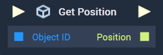
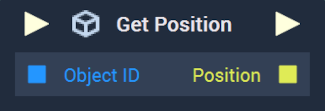

# Get Position

This **Node** has different versions for [**Scenes**](../../../objects-and-types/project-objects/scene.md) and [**Scene2Ds**](../../../objects-and-types/project-objects/scene2d.md). Find in the tabs below the documentation for both versions.



#### Overview

**Get Position** returns the $$X$$, $$Y$$, and $$Z$$ positions of an **Object** in a **Scene**.

[**Scope**](../../overview.md#scopes): **Scene**, **Function**, **Prefab**.

#### Inputs

| Input             | Type         | Description                                                                |
| ----------------- | ------------ | -------------------------------------------------------------------------- |
| _Pulse Input_ (►) | **Pulse**    | A standard **Input Pulse**, to trigger the execution of the **Node**.      |
| `Object ID`       | **ObjectID** | The ID of the target **Scene Object** whose `Position` you wish to return. |

#### Outputs

| Output             | Type        | Description                                                                                                                            |
| ------------------ | ----------- | -------------------------------------------------------------------------------------------------------------------------------------- |
| _Pulse Output_ (►) | **Pulse**   | A standard **Output Pulse**, to move onto the next **Node** along the **Logic Branch**, once this **Node** has finished its execution. |
| `Position`         | **Vector3** | A 3-dimensional **Vector** that contains the $$X$$, $$Y$$, and $$Z$$ positions of the target **Scene Object**.                         |



#### Overview

**Get Position** returns the $$X$$ and $$Y$$ positions of an **Object** in a **Scene2D**.

[**Scope**](../../overview.md#scopes): **Scene**, **Function**, **Prefab**.

#### Inputs

| Input             | Type         | Description                                                                  |
| ----------------- | ------------ | ---------------------------------------------------------------------------- |
| _Pulse Input_ (►) | **Pulse**    | A standard **Input Pulse**, to trigger the execution of the **Node**.        |
| `Object ID`       | **ObjectID** | The ID of the target **Scene2D Object** whose `Position` you wish to return. |

#### Outputs

| Output             | Type        | Description                                                                                                                            |
| ------------------ | ----------- | -------------------------------------------------------------------------------------------------------------------------------------- |
| _Pulse Output_ (►) | **Pulse**   | A standard **Output Pulse**, to move onto the next **Node** along the **Logic Branch**, once this **Node** has finished its execution. |
| `Position`         | **Vector2** | A 2-dimensional **Vector** that contains $$X$$ and $$Y$$ positions of the target **Scene2D Object**.                                   |



## See Also

* [**Get Rotation**](get-rotation.md)
* [**Get Scale**](get-scale.md)
* [**Set Position**](set-position.md)

## External Links

* [_Position (geometry)_](https://en.wikipedia.org/wiki/Position\_\(geometry\)) on Wikipedia.
