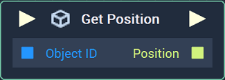
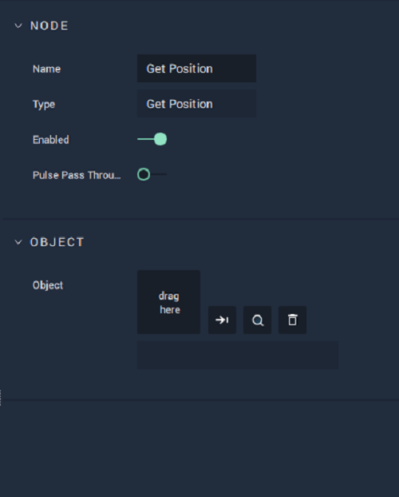

# Get Position

## Overview

**Get Position** returns the _position_ of an **Object** in a **Scene**. The **Object ID** is given as input to the **Node**.

[**Scope**](../../overview.md#scopes): **Scene**, **Function**, **Prefab**.

## Attributes

| Attribute | Type | Description |
| :--- | :--- | :--- |
| `Object` | **ObjectID** | The target **Object**, whose `Position` you wish to return, if one is not provided in the `Object ID` **Socket**. |

## Inputs

| Input | Type | Description |
| :--- | :--- | :--- |
| _Pulse Input_ \(►\) | **Pulse** | A standard **Input Pulse**, to trigger the execution of the **Node**. |
| `Object ID` | **ObjectID** | The ID of the target **Object** whose `Position` you wish to return. |

## Outputs

| Output | Type | Description |
| :--- | :--- | :--- |
| _Pulse Output_ \(►\) | **Pulse** | A standard **Output Pulse**, to move onto the next **Node** along the **Logic Branch**, once this **Node** has finished its execution. |
| `Position` | **Vector3** | A 3-dimensional **Vector** that contains X, Y, and Z _positions_ of the target **Object**. |

## See Also

* [**Get Rotation**](get-rotation.md)
* [**Get Scale**](get-scale.md)
* [**Set Position**](set-position.md)

## External Links

* [_Position \(geometry\)_](https://en.wikipedia.org/wiki/Position_%28geometry%29) on Wikipedia.

