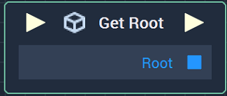

# Overview

The **Get Root** **Node** outputs the **Object ID** of the **Root Object** of the corresponding **Scene**.

The **Root Object** is the _parent_ of all **Objects** on the first hierarchy level in a **Scene**, thus making all **Objects** in the **Scene** its _descendants_. 

See the [**Scene Objects**](../../../objects-and-types/scene-objects/README.md) page for more details about the [**Root Object**](../../../objects-and-types/scene-objects/README.md#root-object), the [**Objects' Structure in a Scene**](../../../objects-and-types/scene-objects/README.md#structure-in-a-scene), and how [**Objects** are referenced in the **Logic**](../../../objects-and-types/scene-objects/README.md#objects-in-the-logic).

[**Scope**](../../overview.md#scopes): **Scene**, **Function**, **Prefab**.

# Inputs

|Input|Type|Description|
|---|---|---|
|*Pulse Input* (►)|**Pulse**|A standard **Input Pulse**, to trigger the execution of the **Node**.|

# Outputs

|Output|Type|Description|
|---|---|---|
|*Pulse Output* (►)|**Pulse**|A standard **Output Pulse**, to move onto the next **Node** along the **Logic Branch**, once this **Node** has finished its execution.|
| `Root` | **ObjectID** | The **Object ID** of the **Root Object** of the corresponding **Scene**. |

# See Also

* [**Root Object**](../../../objects-and-types/scene-objects/README.md#root-object)
* [**Objects Structure in a Scene**](../../../objects-and-types/scene-objects/README.md#structure-in-a-scene)
* [**Objects** in the **Logic**](../../../objects-and-types/scene-objects/README.md#objects-in-the-logic)

