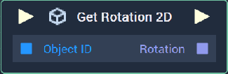
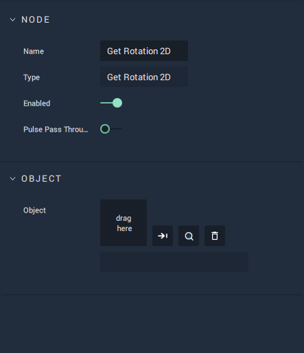

# Get Rotation 2D

## Overview

The **Get Rotation 2D Node** returns the _degree of rotation_ of a **2D Object**.

*Scope*: **Scene**, **Function**, **Prefab**

## Attributes

| Attribute | Type | Description |
| :--- | :--- | :--- |
| `Object` | **ObjectID** | The target **Object** whose `Rotation` you wish to return, if one is not provided in the `Object ID` **Socket**. |

## Inputs

| Input | Type | Description |
| :--- | :--- | :--- |
| _Pulse Input_ \(►\) | **Pulse** | A standard **Input Pulse**, to trigger the execution of the **Node**. |
| `Object ID` | **ObjectID** | The ID of the target **Object** whose `Rotation` you wish to return. |

## Outputs

| Output | Type | Description |
| :--- | :--- | :--- |
| _Pulse Output_ \(►\) | **Pulse** | A standard **Output Pulse**, to move onto the next **Node** along the **Logic Branch**, once this **Node** has finished its execution. |
| `Rotation` | **Float** | The _degree of rotation_ of the target **Object**. |

## See Also

* [**Get Position 2D (px)**](get-position-pixel.md)
* [**Get Size 2D (px)**](get-size-pixel.md)

