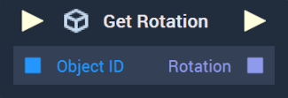

# Get Rotation

This **Node** has different versions for [**Scenes**](../../../objects-and-types/project-objects/scene.md) and [**Scene2Ds**](../../../objects-and-types/project-objects/scene2d.md). Find in the tabs below the documentation for both versions.

## Overview

**Get Rotation** returns the $$X$$, $$Y$$, and $$Z$$ rotation of an **Object** in a **Scene**. 

[**Scope**](../../overview.md#scopes): **Scene**, **Function**, **Prefab**.

## Inputs

| Input | Type | Description |
| :--- | :--- | :--- |
| _Pulse Input_ \(►\) | **Pulse** | A standard **Input Pulse**, to trigger the execution of the **Node**. |
| `Object ID` | **ObjectID** | The ID of the target **Scene Object** whose `Rotation` values one wishes to return. |

## Outputs

| Output | Type | Description |
| :--- | :--- | :--- |
| _Pulse Output_ \(►\) | **Pulse** | A standard **Output Pulse**, to move onto the next **Node** along the **Logic Branch**, once this **Node** has finished its execution. |
| `Rotation` | **Vector3** | A 3-dimensional vector that contains the `Rotation` components measured in Euler angles along the $$X$$, $$Y$$, and $$Z$$ axes of the target **Scene Object**. |





## Overview

**Get Rotation** returns the `Rotation` value of an **Object** in a **Scene2D**. 

[**Scope**](../../overview.md#scopes): **Scene**, **Function**, **Prefab**.

## Inputs

| Input | Type | Description |
| :--- | :--- | :--- |
| _Pulse Input_ \(►\) | **Pulse** | A standard **Input Pulse**, to trigger the execution of the **Node**. |
| `Object ID` | **ObjectID** | The ID of the target **Scene2D Object** whose `Rotation` value you wish to return. |

## Outputs

| Output | Type | Description |
| :--- | :--- | :--- |
| _Pulse Output_ \(►\) | **Pulse** | A standard **Output Pulse**, to move onto the next **Node** along the **Logic Branch**, once this **Node** has finished its execution. |
| `Rotation` | **Float** | A **Float** that contains the `Rotation` value of the target **Scene2D Object**. |





## See Also

* [**Get Scale**](get-scale.md)
* [**Get Position**](get-position.md)
* [**Set Rotation**](set-rotation.md)

## External Links

* [_Rotation_](https://en.wikipedia.org/wiki/Euler_angles) on Wikipedia

