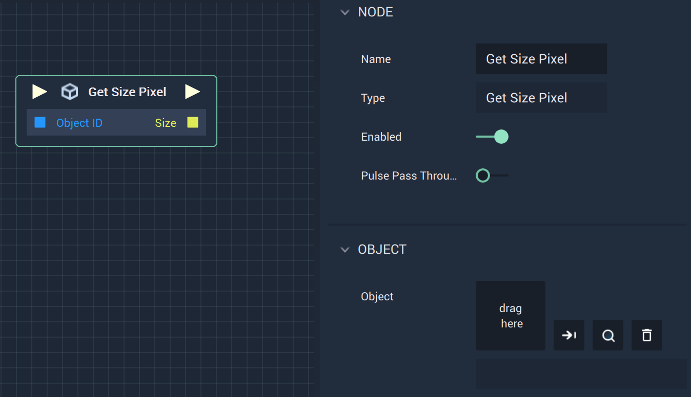

# Overview

The **Get Size Pixel Node** returns the *x* and *y values* of a **2D** or **Vector2D Object's** `Size`.

# Attributes

|Attribute|Type|Description|
|---|---|---|
|`Object`| **ObjectID** | The target **Object** whose `Size` you wish to return, if one is not provided in the `Object ID` **Socket**.|

# Inputs

|Input|Type|Description|
|---|---|---|
|*Pulse Input* (►)|**Pulse**|A standard **Input Pulse**, to trigger the execution of the **Node**.|
|`Object ID`| **ObjectID** |  The ID of the target **Object** whose `Size` you wish to return.|

# Outputs

|Output|Type|Description|
|---|---|---|
|*Pulse Output* (►)|**Pulse**|A standard **Output Pulse**, to move onto the next **Node** along the **Logic Branch**, once this **Node** has finished its execution.|
| `Size` | **Vector2** | A 2-dimensional **Vector** that contains the *x* and *y* `Size` *values* of the target **Object**. |

# See Also

* [**Get Position Pixel**](get-position-pixel.md)
* [**Get Rotation 2D**](get-rotation-pixel.md)

