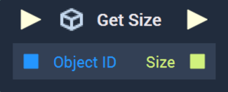
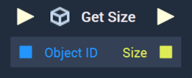

# Get Size

This **Node** has different versions for [**Scenes**](../../../objects-and-types/project-objects/scene.md) and [**Scene2Ds**](../../../objects-and-types/project-objects/scene2d.md). Find in the tabs below the documentation for both versions.





## Overview

The **Get Size Node** returns the $$X$$, $$Y$$, and $$Z$$ values of a **Scene Object's** `Size`.

[**Scope**](../../overview.md#scopes): **Scene**, **Function**, **Prefab**.

## Inputs

| Input | Type | Description |
| :--- | :--- | :--- |
| _Pulse Input_ \(►\) | **Pulse** | A standard **Input Pulse**, to trigger the execution of the **Node**. |
| `Object ID` | **ObjectID** | The ID of the target **Scene Object** whose `Size` you wish to return. |

## Outputs

| Output | Type | Description |
| :--- | :--- | :--- |
| _Pulse Output_ \(►\) | **Pulse** | A standard **Output Pulse**, to move onto the next **Node** along the **Logic Branch**, once this **Node** has finished its execution. |
| `Size` | **Vector3** | A 3-dimensional **Vector** that contains the $$X$$ and $$Y$$ `Size` values of the target **Scene Object**. |





## Overview

The **Get Size Node** returns the $$X$$ and $$Y$$ values of a **Scene2D Object's** `Size`.

[**Scope**](../../overview.md#scopes): **Scene**, **Function**, **Prefab**.

## Inputs

| Input | Type | Description |
| :--- | :--- | :--- |
| _Pulse Input_ \(►\) | **Pulse** | A standard **Input Pulse**, to trigger the execution of the **Node**. |
| `Object ID` | **ObjectID** | The ID of the target **Scene2D Object** whose `Size` you wish to return. |

## Outputs

| Output | Type | Description |
| :--- | :--- | :--- |
| _Pulse Output_ \(►\) | **Pulse** | A standard **Output Pulse**, to move onto the next **Node** along the **Logic Branch**, once this **Node** has finished its execution. |
| `Size` | **Vector2** | A 2-dimensional **Vector** that contains the $$X$$ and $$Y$$ `Size` values of the target **Scene2D Object**. |





## See Also

* [**Get Position**](get-position-pixel.md)
* [**Get Rotation**](get-rotation-pixel.md)