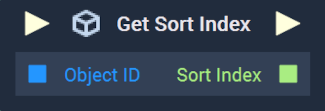

# Overview

The **Get Sort Index Node** returns the sort index of an **Object**, which is the order an **Object** is layered in a **Scene**.

[**Scope**](../../overview.md#scopes): **Scene**, **Function**, **Prefab**.

# Inputs

|Input|Type|Description|
|---|---|---|
|*Pulse Input* (►)|**Pulse**|A standard **Input Pulse**, to trigger the execution of the **Node**.|
|`Object ID`|**ObjectID**|The **Object** of interest.|

# Outputs

|Output|Type|Description|
|---|---|---|
|*Pulse Output* (►)|**Pulse**|A standard **Output Pulse**, to move onto the next **Node** along the **Logic Branch**, once this **Node** has finished its execution.|
|`Sort Index`|**Int**|The sort index of the **Object**.|

# See Also

* [**Set Sort Index**](set-sort-index.md)

