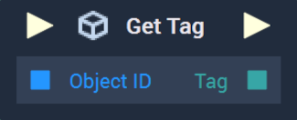

# Overview

The **Get Tag Node** returns the tags that are attributed to the **Object** given as input. If an **Object** with no tags is given, an empty **Array** is returned. 

[**Scope**](../../overview.md#scopes): **Scene**, **Function**, **Prefab**.

# Inputs

|Input|Type|Description|
|---|---|---|
|*Pulse Input* (►)|**Pulse**|A standard **Input Pulse**, to trigger the execution of the **Node**.|
|`Object ID`|**ObjectID**|The **Object** whose tag(s) will be returned.|

# Outputs

|Output|Type|Description|
|---|---|---|
|*Pulse Output* (►)|**Pulse**|A standard **Output Pulse**, to move onto the next **Node** along the **Logic Branch**, once this **Node** has finished its execution.|
|`Tag`|**Array**|An **Array** of the **Object's** tag(s).|

# See Also

* [**Add Tag**](add-tag.md)
* [**Get Objects By Tag**](get-objects-by-tag.md)
* [**Remove Tag**](remove-tag.md)
