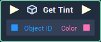

# Get Tint

## Overview

**Get Tint** returns the **Color** of the `Tint` **Attribute** of a given **Object**.

## Attributes

| Attribute | Type | Description |
| :--- | :--- | :--- |
| `Object` | **ObjectID** | The ID of the **Object** whose `Tint` **Attribute**'s **Color** value should be returned if one is not provided in the `Object ID` **Socket**. |

## Inputs

| Input | Type | Description |
| :--- | :--- | :--- |
| _Pulse Input_ \(►\) | **Pulse** | A standard **Input Pulse**, to trigger the execution of the **Node**. |
| `Object ID` | **ObjectID** | The ID of the **Object** whose `Tint` **Attribute**'s **Color** value should be returned. |

## Outputs

| Output | Type | Description |
| :--- | :--- | :--- |
| _Pulse Output_ \(►\) | **Pulse** | A standard **Output Pulse**, to move onto the next **Node** along the **Logic Branch**, once this **Node** has finished its execution. |
| `Color` | **Color** | The **Color** value of the **Object**'s `Tint` **Attribute**. |

## See Also

* [**Set Tint**](set-tint.md)

## External Links

* [_Tints and Shades_](https://en.wikipedia.org/wiki/Tints_and_shades) on Wikipedia.

