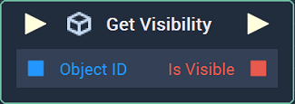
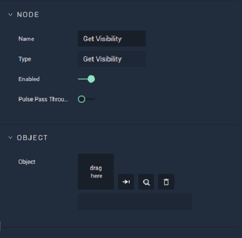

# Get Visibility

## Overview

**Get Visibility** returns a **Boolean** value indicating whether an **Object** is visible in a **Scene** or not.

[**Scope**](../overview.md#scopes):
*  **Scene**, **Function**, **Prefab**

## Attributes

| Attribute | Type | Description |
| :--- | :--- | :--- |
| `Object` | **ObjectID** | The **Object**, whose _visibility_ is desired, if one is not provided in the `Object ID` **Socket**. |

## Inputs

| Input | Type | Description |
| :--- | :--- | :--- |
| _Pulse Input_ \(►\) | **Pulse** | A standard **Input Pulse**, to trigger the execution of the **Node**. |
| `Object ID` | **ObjectID** | The ID of the **Object** whose _visibility_ you wish to return. |

## Outputs

| Output | Type | Description |
| :--- | :--- | :--- |
| _Pulse Output_ \(►\) | **Pulse** | A standard **Output Pulse**, to move onto the next **Node** along the **Logic Branch**, once this **Node** has finished its execution. |
| `Is Visible` | **Bool** | A boolean value that is _true_ if the target **Object** is _visible_ in the **Scene** and _false_ if it is not. |

## See Also

* [**Set Visibility**](set-visibility.md)

