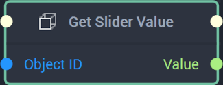

# Overview

The **Get Slider Value Node** returns the current value of a [**Slider's**](../../../objects-and-types/scene2d-objects/gui/slider.md) placement on its handle.

[**Scope**](../../overview.md#scopes): **Scene**, **Function**, **Prefab**.

# Inputs

|Input|Type|Description|
|---|---|---|
|*Pulse Input* (►)|**Pulse**|A standard **Input Pulse**, to trigger the execution of the **Node**.|
|`Object ID`|**ObjectID**|The **Slider Object** whose value shall be returned.|

# Outputs

|Output|Type|Description|
|---|---|---|
|*Pulse Output* (►)|**Pulse**|A standard **Output Pulse**, to move onto the next **Node** along the **Logic Branch**, once this **Node** has finished its execution.|
|`Value`|**Int**|The current `Value` of the **Slider's** placement on its handle.|

# See Also

* [**Set Slider Value**](setslidervalue.md)
