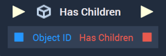
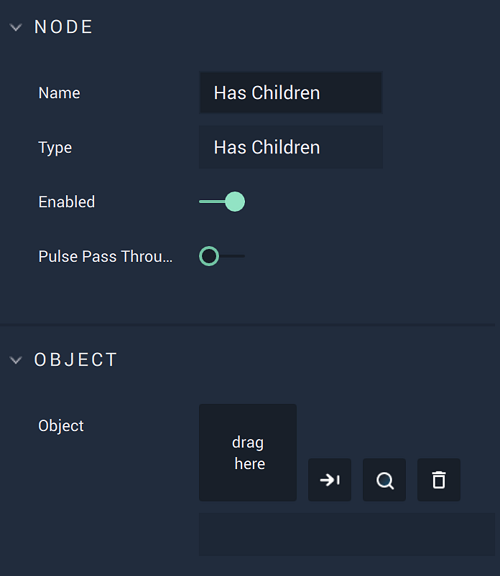

# Overview

The **Has Children Node** returns a **Boolean** of either *true* or *false*, reflecting whether an **Object** has *children* or not.

[**Scope**](../../overview.md#scopes): **Scene**, **Function**, **Prefab**.

# Attributes

|Attribute|Type|Description|
|---|---|---|
|`Object`|**ObjectID**|The **Object** to be checked for *children* **Objects**, if one has not been provided in the **Input Socket**. 

# Inputs

|Input|Type|Description|
|---|---|---|
|*Pulse Input* (►)|**Pulse**|A standard **Input Pulse**, to trigger the execution of the **Node**.|
|`Object ID`|**ObjectID**|The **Object** to be checked for *children* **Objects**.|

# Outputs

|Output|Type|Description|
|---|---|---|
|*Pulse Output* (►)|**Pulse**|A standard **Output Pulse**, to move onto the next **Node** along the **Logic Branch**, once this **Node** has finished its execution.|
|`Has Children`|**Boolean**|Returns *true* if the **Object** has *children*, *false* if not. 

# See Also

* [**Get Children**](get-children.md)
* [**Get Parent**](get-parent.md)

