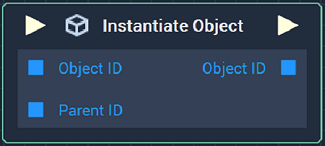

# Overview

The **Instantiate Object Node** can be used to copy an **Object**, including all its *children*, or a **Prefab**. 

This **Node** requires a *parent* of the **Object**. Any **Object** placed in `Parent ID`t will automatically assign it as the *parent* even if the hierarchy was not established before. 

To learn more about the *childre* and *parent* **Objects** in the **Scene** structure, click [here.](../../../objects-and-types/scene-objects/README.md#structure-in-a-scene)

# Attributes

|Attribute|Type|Description|
|---|---|---|
|`Object`|**ObjectID**|The **Object** or **Prefab** to be copied, if one is not provided in the **Input Socket**.|

# Inputs

|Input|Type|Description|
|---|---|---|
|*Pulse Input* (►)|**Pulse**|A standard **Input Pulse**, to trigger the execution of the **Node**.|
|`Object ID`|**ObjectID**|The **Object** or **Prefab** to be copied.|
|`Parent`|**ObjectID**|The *parent* of the **Object** or **Prefab** to be copied.|

# Outputs

|Output|Type|Description|
|---|---|---|
|*Pulse Output* (►)|**Pulse**|A standard **Output Pulse**, to move onto the next **Node** along the **Logic Branch**, once this **Node** has finished its execution.|
|`Object ID`|**ObjectID**|The ID of the **Object** copy.|

# See Also

* [**Destroy**](destroy.md)