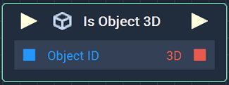
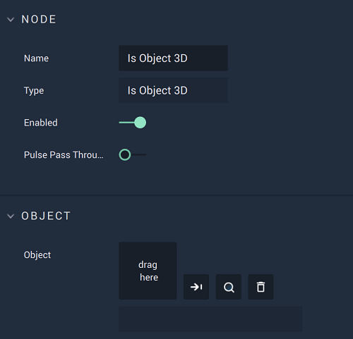

# Overview

The **Is Object 3D Node** returns a **Bool**, depending on whether the input **Object** is *3D* or not. 

# Attributes

|Attribute|Type|Description|
|---|---|---|
|`Object`|**ObjectID**| The **Object** to be checked, if one is not provided in the `Object ID` **Socket**. |

# Inputs

|Input|Type|Description|
|---|---|---|
|*Pulse Input* (►)|**Pulse**|A standard **Input Pulse**, to trigger the execution of the **Node**.|
| `Object ID` | **ObjectID** | The ID of the **Object** to be checked.|

# Outputs

|Output|Type|Description|
|---|---|---|
|*Pulse Output* (►)|**Pulse**|A standard **Output Pulse**, to move onto the next **Node** along the **Logic Branch**, once this **Node** has finished its execution.|
|`3D`|**Bool**|Returns *true* if the **Object** is *3D*, *false* otherwise.| 

# See Also

* [**Bool**](../../../objects-and-types/data-types/bool.md)
* [**Is Object 2D**](is-object-2d.md)

