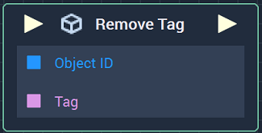
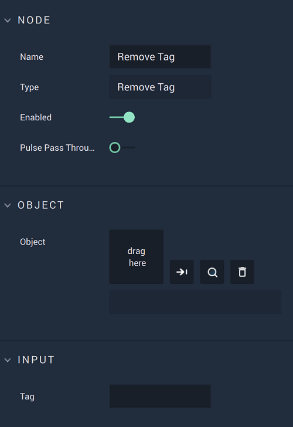

# Overview

The **Remove Tag Node** deletes a *tag* from an **Object**. This *tag* acts as *metadata* and removing it means the **Object** is no longer associated with that *tag*.

# Attributes

## Object

|Attribute|Type|Description|
|---|---|---|
| `Object` | **ObjectID** |The **Object** from which the *tag* will be removed, if none is provided in the **Input Socket**.|

## Input

|Attribute|Type|Description|
|---|---|---|
| `Tag` | **String** |The *tag* to be removed, if none is provided in the **Input Socket**.|

# Inputs

|Input|Type|Description|
|---|---|---|
|*Pulse Input* (►)|**Pulse**|A standard **Input Pulse**, to trigger the execution of the **Node**.|
| `Object ID` | **ObjectID** |The **Object** from which the *tag* will be removed.|
| `Tag` | **String** |The *tag* to be removed.|

# Outputs

|Output|Type|Description|
|---|---|---|
|*Pulse Output* (►)|**Pulse**|A standard **Output Pulse**, to move onto the next **Node** along the **Logic Branch**, once this **Node** has finished its execution.|

# See Also

* [**Add Tag**](add-tag.md)

