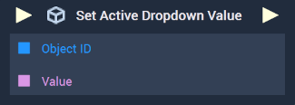

# Overview

The **Set Active Dropdown Value Node** sets the active value for the inputted [**Dropdown Object**](../../../objects-and-types/scene2d-objects/gui/dropdown.md).

[**Scope**](../../overview.md#scopes): **Scene**, **Function**, **Prefab**.

# Inputs

|Input|Type|Description|
|---|---|---|
|*Pulse Input* (►)|**Pulse**|A standard **Input Pulse**, to trigger the execution of the **Node**.|
|`Object ID`|**ObjectID**|The **Dropdown Object** whose active value will be set.|
|`Value`|**String**|The **Dropdown Object's** active value to be set.|

# Outputs

|Output|Type|Description|
|---|---|---|
|*Pulse Output* (►)|**Pulse**|A standard **Output Pulse**, to move onto the next **Node** along the **Logic Branch**, once this **Node** has finished its execution.|

# See Also

* [**Get Active Dropdown Value**](get-active-dropdown-value.md)

