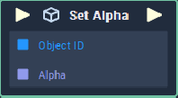

# Overview

**Set Alpha** sets the `alpha` component value of the color space of an **Object**.

The **Set Alpha** node only works with objects that have **Sprite** category as an attribute such as **List**, **Image**, **Sequence**, **Web Sprite**, **Sprite** and **Text**.

# Attributes

|Attribute|Type|Description|
|---|---|---|
|`Object`|**ObjectID**|The **Object** whose color space's `alpha` component is to be set, if one is not provided in the `object ID` **Socket**.|
|`Default Alpha`|**Float**|The default value of the **Object** color space's `alpha` component. 

# Inputs

|Input|Type|Description|
|---|---|---|
|*Pulse Input* (►)|**Pulse**|A standard **Input Pulse**, to trigger the execution of the **Node**.|
|`Object`|**ObjectID**|The ID of the **Object** whose `Alpha` value you would like to set.|
|`Alpha`|**Float**|The input `Alpha` value of the **Object's** color space you seek to set.|

# Outputs

|Output|Type|Description|
|---|---|---|
|*Pulse Output* (►)|**Pulse**|A standard **Output Pulse**, to move onto the next **Node** along the **Logic Branch**, once this **Node** has finished its execution.|

# See Also
[**Get Alpha**](get-alpha.md)

# External Links
- [*Alpha value*](https://en.wikipedia.org/wiki/Alpha_compositing)
